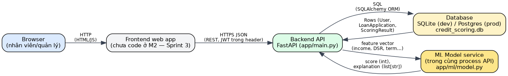
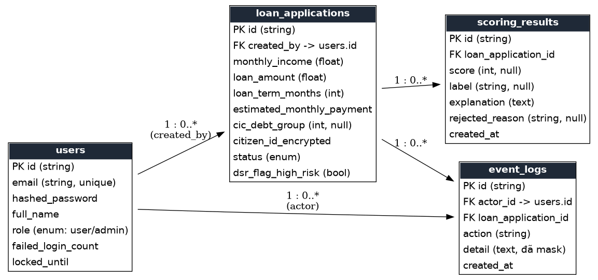

# Design — Credit Scoring Demo

## 1. Architecture



| Component | What it is | Status |
| --- | --- | --- |
| **Browser** | Used by employees and managers (phone or computer). | in use |
| **Frontend web app** | React + Vite single-page app for the screens in M1 section 6. | planned (Sprint 3) |
| **Backend API** | FastAPI service. Owns all business logic and enforces BR1-BR8. | built (skeleton) |
| **Database** | SQLite file `credit_scoring.db` in development, PostgreSQL for a real deployment (switched by `DATABASE_URL`). | built |
| **Scoring module** | Runs **inside the API process**, not as a separate service. Loads `model.joblib` once at startup. In: feature vector. Out: integer score 0-100 and a list of explanation strings. | planned (Sprint 4) |
| **Offline training pipeline** | Trains on the German Credit Dataset and writes `model.joblib`. The dataset is never loaded into the database; only runtime data is stored. | planned (Sprint 4) |

Every arrow is labelled with what travels along it. The API reaches the database through a library (SQLAlchemy), not through another API.

## 2. Data model



| Table | Purpose | Columns (PK/FK, type) | Corresponding business rule (from M1) |
| --- | --- | --- | --- |
| `users` | Stores login accounts with 2 roles: User/Admin | PK `id`, `email` UNIQUE, `hashed_password`, `full_name`, `role` enum, `failed_login_count`, `locked_until` | BR8 (authorization); US01 AC2 (account lockout) through `failed_login_count`/`locked_until` |
| `loan_applications` | Stores a loan application and its processing status | PK `id`, FK `created_by`→users.id, `monthly_income`, `loan_amount`, `loan_term_months`, `estimated_monthly_payment`, `cic_debt_group` NULL, `citizen_id_encrypted` NULL, `status` enum, `dsr_flag_high_risk` bool | BR2 (income > 0, enforced at the API layer), BR3 (DSR → `dsr_flag_high_risk`), BR4 (`cic_debt_group`), BR7 (`citizen_id_encrypted` must not store plaintext data) |
| `scoring_results` | Stores each scoring attempt — one application can have multiple rows for scoring history (US06) | PK `id`, FK `loan_application_id`, `score` int NULL, `label` string NULL, `explanation` text, `rejected_reason` string NULL, `created_at` | BR1 (`score` is NULL when outside [0,100]), BR4 (`rejected_reason`=`cic_bad_debt_group`), BR5 (`rejected_reason`=`rate_limited...`), BR6 (`label`) |
| `event_logs` | Logs all important actions for auditing purposes | PK `id`, FK `actor_id`→users.id NULL, FK `loan_application_id` NULL, `action`, `detail` text (masked), `created_at` | BR7 — `detail` must never contain the full Citizen ID number, only the last 4 digits |

The ERD and the table are consistent — 4 tables, sufficient for the minimum required data model.

## 3. API design

Conventions: JSON under the `/api` prefix, `Authorization: Bearer <JWT>` on everything except login, money in whole VND,
errors as `{"detail": "<message>"}`. This is the design for the whole product; in M2 only the page in section 4 is built.
The order of checks when an application is submitted and scored is: BR2 (income > 0) -> save -> BR3 (set the high-risk flag) -> BR4 (bad-debt
group: reject, model not called) -> BR5 (3 scorings per hour) -> model -> BR1 (score range) -> BR6 (label).

| Method | Path | Input | Success | Error codes | Covers |
| --- | --- | --- | --- | --- | --- |
| POST | `/api/auth/login` | email, password | 200 + JWT | 401 wrong credentials; 422 invalid body; **423** account locked (US01, 15 min) | US01 (P0) |
| POST | `/api/loan-applications` | monthly_income, loan_amount, loan_term_months, estimated_monthly_payment, credit_history_note, purpose, cic_debt_group?, citizen_id? | 201 + application (`pending`, high-risk flag set if DSR > 50%) | 401; **422** missing or malformed field ("Income is required") or income <= 0 | US03, US09 (P0); BR2, BR3 |
| GET | `/api/loan-applications` | - | 200 + list (User: own only; Admin: all) | 401 | US05 list (P1); BR8 |
| GET | `/api/loan-applications/{id}` | - | 200 + data, score, explanation | 401; **403** not the owner; **404** "Application not found" | US05; BR8 |
| PATCH | `/api/loan-applications/{id}` | fields to change | 200 + application | 401; 403; 404; **409** "Application already processed, cannot be edited"; 422 | US10 (P1) |
| PATCH | `/api/loan-applications/{id}/cancel` | - | 200 + cancelled application | 401; 403; 404; 409 already processed | US10 (P1) |
| POST | `/api/loan-applications/{id}/score` | - | 201 + score, label, explanation | 401; 403; 404; 409 cancelled or approved; **429** BR5 limit reached (application becomes `manual_review`) | US04 (P0); BR1, BR3-BR6 |
| GET | `/api/loan-applications/{id}/scores` | - | 200 + history (empty list shown as "No history available") | 401; 403; 404 | US06 (P1) |
| GET | `/api/dashboard/summary` | - | 200 + today's `total_applications` and `average_score` (null when none) | 401 | US08 (P0) |

Not designed yet (P2, or tied to Sprint 4 encryption): logout (US02), notifications (US07), account management (`/admin/users`), the citizen-ID lookup (BR7).

## 4. Walking skeleton

**Route:** `GET /loan-applications` - returns an HTML page, opened directly in the browser, no login yet.
**Table it reads:** `loan_applications`, created and seeded with **12 rows** by `python -m app.seed` (M2 asks for at least 10).
Settings live in `backend/.env.example` (only `DATABASE_URL`); the real `.env` is never committed. Install steps: `SETUP.md`.


The query behind the page (SQLAlchemy, and the SQL it runs):

```python
rows = db.query(LoanApplication).order_by(LoanApplication.created_at.desc()).all()
```

```sql
SELECT * FROM loan_applications ORDER BY created_at DESC;
```

The data comes from the database, not from an array in the code. The test `test_route_reads_the_database_not_a_hardcoded_list`
proves it: it inserts one row, calls the page again, and exactly one more row appears.
Known limits: no authentication yet, so BR8 filtering is not applied; the page escapes all text it reads from the database.
The JSON API lives under `/api`, so the final React page can use the M1 screen route `/loan-applications` without a clash.